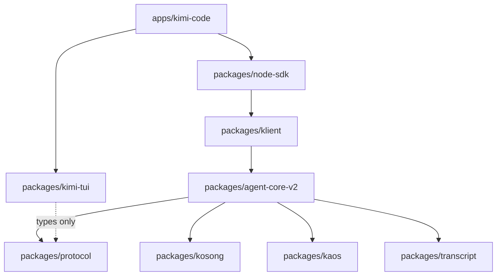

# Architecture Report: CLI-TUI Agentic Harness

- Date: 2026-08-07
- Status: Accepted
- Rigor: R3
- Branch: `chore/bun-biome-ts7`

## North star

The product is a **CLI ⇔ TUI harness only**: one process, one terminal surface, agent capability preserved with minimal footprint.

| Pillar | Target |
|---|---|
| Product surfaces | `apps/kimi-code` CLI + Ink TUI only; `packages/kimi-tui` terminal primitives |
| Engine access | In-process `@moonshot-ai/klient/memory` — no HTTP hop on the default path |
| Search | Bun SQLite FTS (`bun:sqlite`) for session/global search; **ripgrep** fallback for workspace file grep |
| Extensibility | Interceptor pipeline wired through **engine hooks** (loop, tool executor, external hooks) |
| Multi-agent | **Swarm orchestration** lives in `packages/agent-core-v2` (not in a separate server or browser host) |
| Size budget | ~200K–250K LOC product source (excl. tests/generated) |

**Out of scope for the default product path:** `kap-server`, browser UIs (`kimi-web`, `vis`, `kimi-inspect`), `kimi web`, and any bundled web assets.

## 1. Task Contract

### Objective

- `OBJ-001` — Reduce the product to a proper agentic harness with a minimal footprint while preserving agent capability.
- `OBJ-002` — CLI (`apps/kimi-code`) and TUI (Ink in `apps/kimi-code`, primitives in `packages/kimi-tui`) are the only product surfaces.
- `OBJ-003` — Enforce ≤800 LOC per source file (no formatting tricks) and acyclic package deps.
- `OBJ-004` — Target ~200K–250K LOC for the harness product line (source, excluding tests/generated).

### Requirements

- `REQ-001` — Keep top-level package directory names; rewrite internals.
- `REQ-002` — Idiomatic ES6+ TypeScript; capability modules over helper colonies.
- `REQ-003` — Strip novelty users of a harness never need (telemetry cloud pipeline, easter eggs, design-system demo chrome, browser UIs, HTTP server edge on the default path).
- `REQ-004` — Function and behaviour over prose; rollbackable git slices.
- `REQ-005` — CI rework deferred until product slices land.

### Constraints

- `CON-001` — Hard max 800 LOC / file.
- `CON-002` — Max ~3–4 parallel workers per wave.
- `CON-003` — Do not thrash lint/format during migration.
- `CON-004` — No cyclic dependencies across packages.

### Explicit exclusions

- `EXC-001` — CI pipeline rewrite (later).
- `EXC-002` — Publishing / release choreography changes.
- `EXC-003` — Rewriting tree-sitter-bash generated parser (vendor exception; keep out of product LOC budget accounting or isolate).

### Definition of done (program)

1. Ink TUI in `apps/kimi-code` backed by `packages/kimi-tui` terminal primitives; no browser hosts.
2. Default startup uses in-process `klient/memory`; no kap-server on the default path.
3. Telemetry cloud/novelty surfaces removed or reduced to a no-op interface.
4. No authored product source file >800 LOC (except documented vendor exceptions).
5. Product-line source LOC in 200K–250K.
6. Dependency graph acyclic under the direction below.
7. Each wave committed as a rollbackable slice.

## 2. Evidence

| ID | Class | Claim | Source | Impact |
|---|---|---|---|---|
| E-001 | FACT | Product source ≈408K LOC (excl. tests) | inventory 2026-08-07 | Must cut ~150–200K |
| E-002 | FACT | 98 files >800 LOC | inventory | Must split or delete |
| E-003 | FACT | Ink owns TUI stdout; pi-tui dual trees remain | `tui-lifecycle.ts`, audit | Dual maintenance |
| E-004 | FACT | Telemetry domain ≈2.1K LOC + call sites | `agent-core-v2/src/app/telemetry` | Novelty strip target |
| E-005 | USER | CLI⇔TUI only; drop web/vis/inspect apps | user directive | Delete browser hosts |
| E-006 | USER | In-process klient/memory; no kap-server default | user directive | Remove HTTP edge from hot path |
| E-007 | USER | Bun SQLite search + ripgrep fallback | user directive | Replace minidb server index |
| E-008 | USER | Keep package dir names; change internals | user directive | No new top-level package names |
| E-009 | USER | CI after product | user directive | Do not block on CI |

## 3. Domain and Boundary Model

### Vocabulary

| Term | Definition |
|---|---|
| Harness | Agent runtime + thin CLI/TUI client; no product analytics / novelty chrome |
| Ink host | `apps/kimi-code` TUI that renders via Ink |
| Memory klient | `@moonshot-ai/klient/memory` — in-process bridge to the engine |
| Engine | `packages/agent-core-v2` DI×Scope agent runtime (swarm, hooks, tools, sessions) |
| Interceptor pipeline | Ordered engine-hook listeners (loop, tool executor, external hooks) that observe/mutate agent steps |

### Boundaries and owners

| Boundary | Responsibility | State owned | Contracts |
|---|---|---|---|
| `packages/agent-core-v2` | Agent/session/workspace/app services, swarm, hook pipeline | Engine state, wire | Service interfaces, wire records, hook registration |
| `packages/klient` | In-process (memory) and optional IPC client façade | None | `Klient`, zod-validated RPC |
| `packages/node-sdk` | Public harness SDK (`@moonshot-ai/kimi-code-sdk`) | Client session façade | SDK types |
| `packages/kimi-tui` | Terminal primitives + optional Ink adapters | None (pure view) | Component props, terminal I/O |
| `apps/kimi-code` | CLI + Ink host | TUI coordinator state | CLI flags, Ink mount |
| `packages/transcript` | Transcript L1–L4 (TUI projection data) | None | Contract schemas |
| `packages/protocol` | Shared wire/error types | None | Types only |

### Dependency direction (acyclic)

Forbidden: `kimi-tui → agent-core-v2`, `agent-core-v2 → kimi-tui`, `apps/kimi-code → agent-core-v2` (must go through SDK/klient).

**Deleted from the tree:** `packages/kap-server`, `packages/minidb`, `packages/server-e2e` (legacy HTTP server stack; klient hosts the retired wire e2e suites). Browser apps (`kimi-web`, `vis`, `kimi-inspect`) remain migration targets for deletion or quarantine.

## 4. Quality-Attribute Scenarios

| ID | Scenario | Measure | Priority |
|---|---|---|---|
| QA-001 | Open TUI, send prompt, see tool/swarm cards | Ink-only path; in-process klient | P0 |
| QA-002 | Session/global search via Bun SQLite; workspace grep via ripgrep | No minidb/kap-server on default path | P0 |
| QA-003 | Build graph has no package cycles | import check | P0 |
| QA-004 | Any new/edited product file ≤800 LOC | LOC gate (later CI) | P0 |
| QA-005 | Harness runs with telemetry disabled/absent | No cloud appenders; no network side effects | P1 |
| QA-006 | Product-line LOC ≤250K | Inventory script | P1 |
| QA-007 | Swarm enter/exit and subagent delegation | Engine `swarm` domain only | P1 |
| QA-008 | Plugin/hook interceptors run through engine hook pipeline | No parallel ad-hoc middleware | P1 |

## 5. Candidates

### A — Do-less baseline

Keep dual Vue/React/pi-tui and browser apps. Liabilities: fails OBJ-002/003/004. **Rejected.**

### B — New UI package

Violates `REQ-001`. **Rejected.**

### C — CLI⇔TUI harness with in-process engine (**selected**)

- `packages/kimi-tui` — terminal primitives + Ink adapters
- `apps/kimi-code` — CLI, Ink TUI, `@moonshot-ai/kimi-code-sdk` over `klient/memory`
- `packages/agent-core-v2` — swarm orchestration + hook/interceptor pipeline
- Search: Bun SQLite index in-process; ripgrep for workspace tools
- Deleted: `apps/kimi-web`, `apps/vis`, `apps/kimi-inspect`; kap-server removed from default path

## 6. Source-topology ownership map (target)

| Path | Owner | Reason | Visibility | Lifecycle | Dependencies | Why separate |
|---|---|---|---|---|---|---|
| `packages/kimi-tui/src/ink/*` | TUI kit | Ink host adapters | public | TUI runtime | react, ink | Capability: Ink host |
| `packages/kimi-tui/src/terminal/*` | TUI kit | Low-level TTY primitives | public | TUI runtime | node tty | Capability: terminal I/O |
| `apps/kimi-code/src/tui/*` | CLI host | Coordinator, controllers | app-private | process | kimi-tui, sdk | Host wiring only |
| `packages/klient/src/transports/memory/*` | Klient | In-process engine bridge | public | process | agent-core-v2 | Default transport |
| `packages/agent-core-v2/src/agent/swarm/*` | Engine | Swarm orchestration | internal | process | wire ops | Multi-agent in-engine |
| `packages/agent-core-v2/src/agent/*/hooks*` | Engine | Interceptor pipeline | internal | process | loop, tool executor | Extensibility boundary |
| `packages/agent-core-v2/src/app/telemetry/*` | Engine | **No-op / delete cloud** | internal | process | none | Shrink to interface stub |

## 7. Migration sequence (waves)

| Wave | Slice | Rollback |
|---|---|---|
| 0 | This architecture commit | revert commit |
| 1 | Strip novelty: telemetry → no-op; delete easter eggs / tips chrome | revert commits |
| 2 | Scaffold `kimi-tui` `ink/` + terminal exports | revert commits |
| 3 | Split >800 LOC hot-path files | revert per file slice |
| 4 | **Delete web/vis/inspect apps; default to klient/memory** | revert |
| 5 | Replace kap-server/minidb search with Bun SQLite + ripgrep fallback | revert |
| 6 | Delete dead pi-tui transcript dual path in kimi-code | revert |
| 7 | LOC budget pass + cycle check; bun package manager; CI refresh | — |

### Kosong / provider compat layers (completed on this branch)

| Layer | Scope | Outcome |
|---|---|---|
| 0–1 | `packages/kosong` protocol profiles | Model-family presets (OpenAI, Anthropic, Google, Kimi, DeepSeek, MiniMax) with transport + reasoning metadata |
| 2 | Streaming assembler | Gap fixes for partial tool/reasoning deltas in kosong adapters |
| 3 | Runtime wiring | Protocol profile replay invariants in agent-core catalog + context projector |
| 4 | Headless print | `apps/kimi-code` routes print through `@moonshot-ai/kimi-code-sdk` |
| 5 | Swarm | Orchestrator profile, worker pool chrome, `[swarm]` config section |

`packages/agent-core-v2` keeps an internal `src/kosong/protocol/*` tree for adapter registration; it does not depend on `@moonshot-ai/kosong` at the package boundary.

## 8. Novelty strip policy

**Remove / no-op**

- Cloud telemetry transport, event catalogs used only for product analytics, privacy upload pipeline
- TUI easter eggs (`dance`), rotating influencer tips
- Browser UIs (`kimi-web`, `vis`, `kimi-inspect`), bundled `dist-web` assets, TUI `/web` slash command, `kimi vis`, `kimi web`
- kap-server and minidb removed from the tree; global search is in-process (Bun SQLite + ripgrep fallback)
- Marketplace/CDN novelty not required for harness operation (evaluate per-call-site; keep real plugin install)

**Keep**

- Permission modes, tools, swarm (engine-owned), goals, MCP, skills, transcript projection, OAuth login (auth is functional)
- Engine hook / interceptor pipeline for plugins and internal cross-cutting concerns
- Experimental flags mechanism (thin)

## 9. File size policy

- Soft split trigger: 600 LOC. Hard fail: >800 LOC authored product source.
- Vendor exception list (must stay named): `packages/tree-sitter-bash/src/parser.ts` (generated grammar).
- Prefer capability splits (render / state / parse), never `helpers.ts` / `utils2.ts` colonies.

## 10. Verification (per wave)

- Focused vitest/bun tests for touched packages only (no full-repo lint thrash).
- LOC inventory script after each major wave.
- Import-boundary check: kimi-code ↛ agent-core-v2 (except temporary debt tracked for deletion).
- Architecture audit after topology waves (exclude generated `dist*` from tree or untrack them).

## 11. Rejected alternatives & evolution triggers

- Shared React kit across web/vis/TUI → rejected (`OBJ-002`).
- New UI package name → rejected (`REQ-001`).
- Keep full telemetry → rejected (`OBJ-001`).
- kap-server as default harness transport → rejected (`E-006`).
- Browser-hosted session UI → rejected (`E-005`).

Evolution triggers: LOC >250K again; new second UI framework; cycle detected; file >800 LOC introduced; reintroduction of HTTP edge on the default path without explicit architecture revision.

## 12. Rollback boundary

Every wave is one or more conventional commits on `chore/bun-biome-ts7`. No history rewrite. Wave N+1 does not start until Wave N compiles for its package filter.
