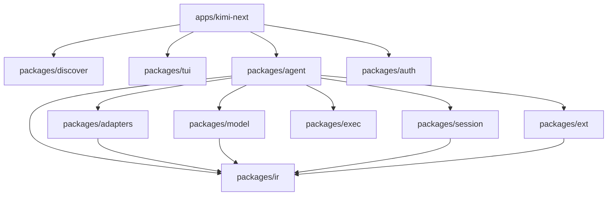

# Architecture Report: kimi-next Protocol-Centered Harness

- Date: 2026-08-08
- Status: Accepted
- Rigor: R3
- Platform: darwin + linux only (Windows excluded)

## North star

**kimi-next** is a personal, POSIX-first CLI ↔ TUI coding agent. **CLI is completed first**; Ink TUI is a presentation surface over the same agent APIs.

| Pillar | Target |
|---|---|
| Product | `apps/kimi-next` binary `kimi-next` |
| Protocol | `packages/ir` — messages, turns, tools, reasoning, events |
| Discovery | `packages/discover` — universal **first-found** instructions/skills/hooks/configs |
| Providers | `packages/model` + `packages/adapters` — never agent/TUI `if (provider)` |
| Context | Session archive (never lossy) + derived active LLM context |
| Hooks | Only SessionStart, UserPromptSubmit, PreToolUse, PostToolUse, PreCompact |
| Auth | Real credentials only — no stub tokens |
| Platform | macOS + Linux |

## Universal first-found

| Pattern | Behavior |
|---------|----------|
| Instruction files | Walk cwd→parents; pick exactly one from candidate set |
| Skills / hooks / configs | Scan compat roots in order; first name/event wins |

Instruction candidates: `AGENTS.md` → `agents.md` → `CLAUDE.md` → `GEMINI.md` → `AGENT.md` → `.agents.md`.

Compat roots: `.agents/` → `.kimi-next/` → `.kimi-code/` → `.pi/` → `.claude/` → `.codex/` → `.goose/`.

## Package topology

```
apps/kimi-next/          CLI + Ink TUI host (readline via --repl)
packages/discover/       First-found instructions, skills, hooks, roots
packages/ir/             Canonical protocol (leaf)
packages/model/          Catalog (models.dev), profiles, validation
packages/adapters/       Transport adapters
packages/agent/          Loop, tools, permissions, hooks ports, swarm, steer
packages/session/        JSONL archive, compact
packages/exec/           POSIX fs/process
packages/tui/            Ink primitives + projection helpers
packages/ext/            Plugins + MCP
packages/auth/           Real multi-provider credentials
packages/bash-parse/     Bash lexer
```



**Forbidden:** `tui → agent`, `adapters → agent`, `ir → *`, `agent → tui`, provider-name switches in agent/TUI.

## Dual truth

| Store | Lossy? | Owner |
|---|---|---|
| Session archive (JSONL) | Never | `session` |
| Active LLM context | Yes — derived | `agent` |
| TUI projection | Display only | `tui` + host |

## Programs

- **A — CLI complete:** discover, hooks, real auth, models.dev/cache, real glob, mid-turn abort, steering, model/effort swaps.
- **B — Ink TUI:** React+Ink (tura-next style) is the default interactive path over `InteractiveHost`; `--repl` remains as escape hatch.

## Non-goals

Windows; hooks beyond the five; upstream kimi-code merge; agent-core-v2/klient stack.
