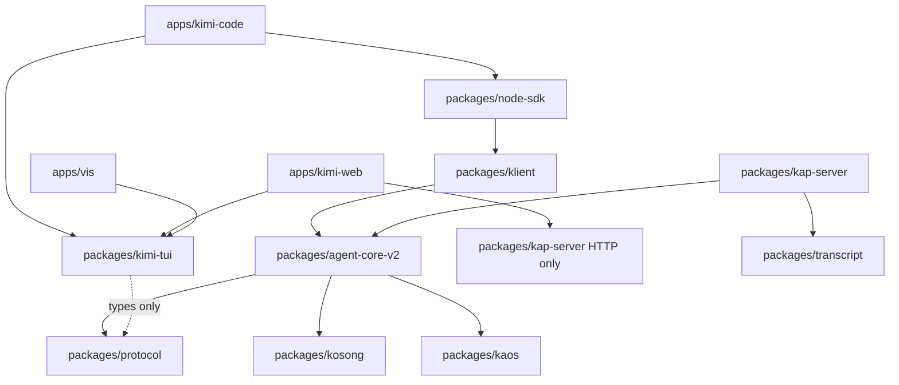

# Architecture Report: Minimal Agentic Harness

- Date: 2026-08-07
- Status: Accepted
- Rigor: R3
- Branch: `chore/bun-biome-ts7`

## 1. Task Contract

### Objective

- `OBJ-001` — Reduce the product to a proper agentic harness with a minimal footprint while preserving agent capability.
- `OBJ-002` — Unify web / vis / TUI on one React component kit; TUI hosts via Ink.
- `OBJ-003` — Enforce ≤800 LOC per source file (no formatting tricks) and acyclic package deps.
- `OBJ-004` — Target ~200K–250K LOC for `cli ⇔ tui ⇔ web ⇔ vis` (source, excluding tests/generated).

### Requirements

- `REQ-001` — Keep top-level package directory names; rewrite internals.
- `REQ-002` — Idiomatic ES6+ TypeScript; capability modules over helper colonies.
- `REQ-003` — Strip novelty users of a harness never need (telemetry cloud pipeline, easter eggs, design-system demo chrome, influencer tips).
- `REQ-004` — Function and behaviour over prose; rollbackable git slices.
- `REQ-005` — CI rework deferred until product slices land.

### Constraints

- `CON-001` — Hard max 800 LOC / file.
- `CON-002` — Max ~3–4 parallel workers per wave.
- `CON-003` — Do not thrash lint/format during migration.
- `CON-004` — No cyclic dependencies across packages.

### Explicit exclusions

- `EXC-001` — CI pipeline rewrite (later).
- `EXC-002` — Publishing / release choreography changes.
- `EXC-003` — Rewriting tree-sitter-bash generated parser (vendor exception; keep out of product LOC budget accounting or isolate).

### Definition of done (program)

1. Shared React kit owned by `packages/kimi-tui`; Ink adapters for TUI; web/vis consume the same kit.
2. Telemetry cloud/novelty surfaces removed or reduced to a no-op interface.
3. No authored product source file >800 LOC (except documented vendor exceptions).
4. Product-line source LOC in 200K–250K.
5. Dependency graph acyclic under the direction below.
6. Each wave committed as a rollbackable slice.

## 2. Evidence

| ID | Class | Claim | Source | Impact |
|---|---|---|---|---|
| E-001 | FACT | Product source ≈408K LOC (excl. tests) | inventory 2026-08-07 | Must cut ~150–200K |
| E-002 | FACT | 98 files >800 LOC | inventory | Must split or delete |
| E-003 | FACT | Ink owns TUI stdout; pi-tui dual trees remain | `tui-lifecycle.ts`, audit | Dual maintenance |
| E-004 | FACT | Telemetry domain ≈2.1K LOC + call sites | `agent-core-v2/src/app/telemetry` | Novelty strip target |
| E-005 | FACT | kimi-web still Vue-heavy + DesignSystemView 2.4K | `apps/kimi-web` | Unify on React |
| E-006 | USER | Keep package dir names; change internals | user directive | No new top-level package names |
| E-007 | USER | CI after product | user directive | Do not block on CI |

## 3. Domain and Boundary Model

### Vocabulary

| Term | Definition |
|---|---|
| Harness | Agent runtime + thin clients; no product analytics / novelty chrome |
| UI kit | Shared React components + projections used by web, vis, and Ink TUI |
| Ink host | `apps/kimi-code` TUI that renders the kit via Ink |
| React host | `apps/kimi-web` / `apps/vis` that render the kit in the browser |
| Engine | `packages/agent-core-v2` DI×Scope agent runtime |

### Boundaries and owners

| Boundary | Responsibility | State owned | Contracts |
|---|---|---|---|
| `packages/agent-core-v2` | Agent/session/workspace/app services | Engine state, wire | Service interfaces, wire records |
| `packages/kap-server` | HTTP/WS edge | Live sessions, search | `/api/v1`, transcript ops |
| `packages/node-sdk` | Public harness SDK | Client session façade | SDK types |
| `packages/kimi-tui` | **UI kit** (React + Ink adapters + terminal primitives) | None (pure view) | Component props, projections |
| `apps/kimi-code` | CLI + Ink host | TUI coordinator state | CLI flags, Ink mount |
| `apps/kimi-web` | Browser React host | Client session UI state | REST/WS wire (local types → later protocol) |
| `apps/vis` | Replay/debug React host | Replay view state | Server debug/replay APIs |
| `packages/transcript` | Transcript L1–L4 | None | Contract schemas |
| `packages/protocol` | Shared wire/error types | None | Types only |

### Dependency direction (acyclic)

Forbidden: `kimi-tui → agent-core-v2`, `kimi-web → agent-core-v2`, `agent-core-v2 → kimi-tui`, `kap-server → apps/*`.

## 4. Quality-Attribute Scenarios

| ID | Scenario | Measure | Priority |
|---|---|---|---|
| QA-001 | Open TUI, send prompt, see tool/swarm cards | Ink-only path; no pi-tui stdout | P0 |
| QA-002 | Open web and vis; same message/tool components | Shared kit imports | P0 |
| QA-003 | Build graph has no package cycles | `madge` / import check | P0 |
| QA-004 | Any new/edited product file ≤800 LOC | LOC gate (later CI) | P0 |
| QA-005 | Harness runs with telemetry disabled/absent | No cloud appenders; no network side effects | P1 |
| QA-006 | Product-line LOC ≤250K | Inventory script | P1 |

## 5. Candidates

### A — Do-less baseline

Keep dual Vue/React/pi-tui. Liabilities: fails OBJ-002/003/004. **Rejected.**

### B — New `@moonshot-ai/kimi-ui` package

Clean ownership, but violates `REQ-001` (new top-level dir). **Rejected.**

### C — Rewrite `packages/kimi-tui` internals as the shared kit (**selected**)

- `packages/kimi-tui/src/react/` — shared React components
- `packages/kimi-tui/src/ink/` — Ink host adapters
- `packages/kimi-tui/src/terminal/` — retained terminal primitives (width, keys, editor core as needed)
- Hosts: `apps/kimi-code` (Ink), `apps/kimi-web`, `apps/vis` (DOM React)

Benefits: same dir name, one owner for UI, deletes Vue dual path over time.
Liabilities: large rewrite of kimi-tui; careful export surface.

### D — Put shared UI under `apps/kimi-web` and import from TUI

Wrong dependency direction (CLI depending on web app). **Rejected.**

## 6. Source-topology ownership map (target)

| Path | Owner | Reason | Visibility | Lifecycle | Dependencies | Why separate |
|---|---|---|---|---|---|---|
| `packages/kimi-tui/src/react/*` | UI kit | Shared views | public exports | app runtime | react, protocol types | Capability: presentation |
| `packages/kimi-tui/src/ink/*` | UI kit | Terminal host adapters | public | TUI runtime | react, ink, react/ | Capability: Ink host |
| `packages/kimi-tui/src/terminal/*` | UI kit | Low-level TTY primitives | public | TUI runtime | node tty | Capability: terminal I/O |
| `apps/kimi-code/src/tui/*` | CLI host | Coordinator, controllers | app-private | process | kimi-tui, sdk | Host wiring only |
| `apps/kimi-web/src/*` | Web host | Browser shell | app-private | browser | kimi-tui, REST | Host wiring only |
| `apps/vis/*` | Vis host | Replay shell | app-private | browser | kimi-tui, server | Host wiring only |
| `packages/agent-core-v2/src/app/telemetry/*` | Engine | **No-op / delete cloud** | internal | process | none | Shrink to interface stub |
| `packages/kap-server/src/*` | Server | Edge transport | public HTTP | server | core, transcript | Edge boundary |

## 7. Migration sequence (waves)

| Wave | Slice | Rollback |
|---|---|---|
| 0 | This architecture commit | revert commit |
| 1 | Strip novelty: telemetry → no-op; delete easter eggs / tips chrome / DesignSystemView | revert commits |
| 2 | Scaffold `kimi-tui` `react/` + `ink/` + move first shared pieces (transcript cards) | revert commits |
| 3 | Split >800 LOC hot-path files (swarm, tool-call, ink-dialogs, session-event-handler, web composables) | revert per file slice |
| 4 | kimi-web: delete Vue island; host on shared React kit | revert |
| 5 | vis: React-only on shared kit | revert |
| 6 | Delete dead pi-tui transcript dual path in kimi-code | revert |
| 7 | LOC budget pass + cycle check; then CI | — |

## 8. Novelty strip policy

**Remove / no-op**

- Cloud telemetry transport, event catalogs used only for product analytics, privacy upload pipeline
- TUI easter eggs (`dance`), rotating influencer tips
- Web `DesignSystemView` and similar non-product demo surfaces
- Marketplace/CDN novelty not required for harness operation (evaluate per-call-site; keep real plugin install)

**Keep**

- Permission modes, tools, swarm, goals, MCP, skills, transcript, search, OAuth login (auth is functional)
- Experimental flags mechanism (thin)

## 9. File size policy

- Soft split trigger: 600 LOC. Hard fail: >800 LOC authored product source.
- Vendor exception list (must stay named): `packages/tree-sitter-bash/src/parser.ts` (generated grammar).
- Prefer capability splits (render / state / parse), never `helpers.ts` / `utils2.ts` colonies.

## 10. Verification (per wave)

- Focused vitest/bun tests for touched packages only (no full-repo lint thrash).
- LOC inventory script after each major wave.
- Import-boundary check: kimi-code ↛ agent-core-v2 (except temporary debt tracked for deletion).
- Architecture audit after topology waves (exclude generated `dist*` from tree or untrack them).

## 11. Rejected alternatives & evolution triggers

- New UI package name → rejected (`REQ-001`).
- Keep Vue + React forever → rejected (`OBJ-002`).
- Keep full telemetry → rejected (`OBJ-001`).

Evolution triggers: LOC >250K again; new second UI framework; cycle detected; file >800 LOC introduced.

## 12. Rollback boundary

Every wave is one or more conventional commits on `chore/bun-biome-ts7`. No history rewrite. Wave N+1 does not start until Wave N compiles for its package filter.
